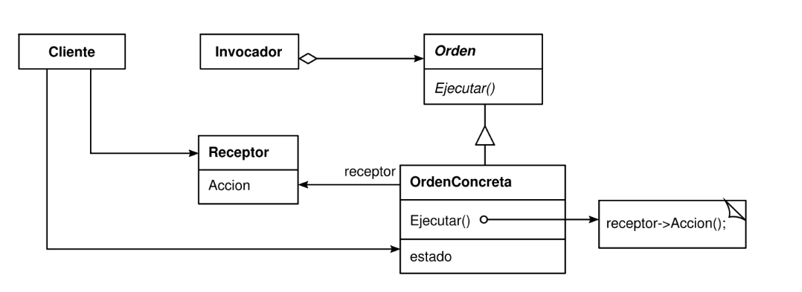

# Patron Command - Ejercicio interactivo conceptual 

Implementación de un patrón Command
Dado un Jugador (Receptor) que implementa (extiende) de una clase abstracta MovimientoCommand, una serie de comandos concretos Avanzar, Retroceder, Subir, Bajar, Correr. Interactuar con el teclado (invoker) para darle instrucciones al Jugador que vaya cambiando su posición X e Y en el eje de coordenadas del tablero.
